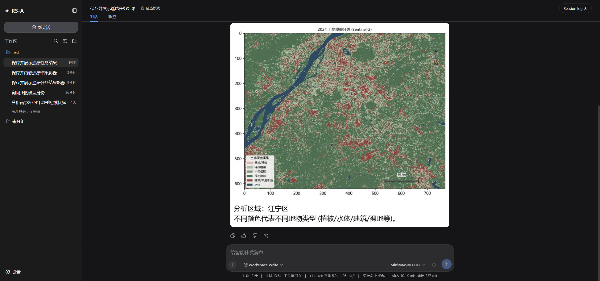

# 🛰️ RS-A · AI 遥感分析 Agent（自包含发布单元）

> 面向**没用过 GEE 的中国普通人**的中文自然语言遥感分析 Agent。
> 一句「分析南京的植被」→ Agent 生成遥感处理代码 → 四层防护 → 云端执行 →
> 结果 JPEG 直接内嵌在对话里。

  

**核心理念：遥感技术平权**——遥感不该是专业特权，普通人（记者、农户、应急人员）也应该能用卫星数据回答自己的问题。



## 架构：双层 Agent

RS-A 是**双层架构**——对话与分工各司其职：

```
用户（RS-A 网页 / 桌面窗口）
   │ 中文对话
   ▼
【前台】dsh 对话 Agent（DeepSeek Harness, :3080, MiniMax-M3）
   │  会话编排 · 思考折叠 · 品牌化 UI · 凭证面板
   │  调用五个 rs_* 工具（remote-sensing-tools 插件）
   ▼
【后台】FastAPI 分析引擎（:8000, src/, LangGraph）
   │  流水线: clarify → plan → generate → execute → diagnose → output
   │  四层防护: validator 白名单 → reviewer 子Agent → sandbox 试跑 → anchors 锚点评测
   │  Wiki 知识库防幻觉 · 数据集目录 · 错误分层人话 · 澄清续跑
   ▼
GEE 云端执行 ──▶ 结果 JPEG ──▶ /rs-image 同源代理 ──▶ 内嵌回对话
```

前台负责"听懂人话、决定调用什么"；后台负责"生成遥感代码、防幻觉防算错、
云端执行出图"。两者经 HTTP 工具边界解耦——引擎不依赖 dsh 也可独立服务
（MCP/CLI 亦可接入）。

## 本仓库是什么

`RS-agent/` 是 RS-A 的**自包含发布单元**：把仓库根的引擎源码、dsh 融合配置、
原生插件、桌面版打包规格收拢在一个目录，可独立部署 / 推送 GitHub。

```
RS-agent/
├── src/                   # FastAPI 分析引擎（LangGraph 流水线 + 四层防护 + Wiki 知识库）
├── tests/                 # 342 项测试（白名单/校验/geo/jobs/wiki/制图契约…）
├── evalset/ evals/        # 18 用例评测集 + 自动判分
├── remote-sensing-tools/  # dsh TS 原生插件：五 rs_* 工具 + 领域人设 + /rs-image 对话内嵌图
├── dsh/                   # dsh 挂接补丁（品牌 RS-A 化 + 插件注入）与固化 profile
├── dsh-config/            # ~/.dsh 用户层配置镜像（新机装机母本，密钥仅 env 引用）
├── scripts/               # sidecar 启动脚本 / 插件 junction 安装 / 同步打包工具
└── .env.example           # 配置模板（主密钥 + 四供应商 LLM key）
```

## 快速开始

```bash
# 0) 依赖: Python 3.11 + Node.js(含全局 dsh)
pip install -r requirements.txt
npm i -g @deepseek-ai/dsh

# 1) 配置
cp .env.example .env          # 填 REMOTE_SENSING_MASTER_KEY 与任一 LLM key
python -m uvicorn src.main:app --host 127.0.0.1 --port 8000

# 2) dsh 网页端 (RS-A 品牌版)
#    先建插件 junction: scripts/install-rs-agent.cmd
#    再把 dsh-config/ 的 settings.yaml 与 profiles/* 复制到 ~/.dsh/
dsh --patch dsh/cordis.patch.yml --profile web --no-open
#    → 浏览器打开 http://127.0.0.1:3080

# 3) 绑定 GEE 凭证
#    设置 → 凭证管理 → 粘贴 Service Account JSON（只进本机后端加密盘）
```

### 桌面版形态（可选）

`RS-A.spec` 为 PyInstaller 打包规格：`RS-A.exe` 双击即得独立桌面窗口
（pywebview 内嵌 dsh 网页端，秒开暗色加载页、关窗即全退）：

```bash
python -m PyInstaller RS-A.spec --noconfirm --distpath cache/dist --workpath cache/build
# 点击即安装的 Setup.exe (需先按上步出 dist, 再以其中 RS-A.exe+_internal 为载荷):
#   ISCC.exe scripts/RS-A.iss   →  cache/releases/RS-A-Setup-<ver>.exe
#   (per-user 安装免管理员; 开始菜单/桌面快捷方式; 自带卸载器)
```

## 凭证安全边界（铁律）

- GEE Service Account Key **只进本机后端加密盘**（Fernet，主密钥在 `.env`），
  执行瞬间解密用完即弃，绝不上传、绝不在插件/dsh 侧出现
- dsh 侧仅持 Bearer 访问令牌，经环境变量运行时注入（`!!js process.env`），
  任何 yaml/json 都不落明文
- per-user 隔离：多用户各自加密凭证，任务/记录按用户隔离

## 为什么需要"四层防护"

arXiv（Kao et al., 2026）实测：LLM 生成的 GEE 代码 **58% 跑不起来**，头号死因
是 API 幻觉与数据集选错。本项目的答案：

| 层 | 拦截什么 |
|---|---|
| 第 0 层 plan 确定性三查 | 计划里的数据集/波段/时间窗不合法 |
| ① validator 白名单 | 编造的 Collection ID / 波段名 / 数据集↔波段错配 |
| ② reviewer 子 Agent | 语义级错误 |
| ③ sandbox 试跑 | 运行时错误（真实超时拒绝全量执行） |
| ④ anchors 锚点评测 | **算错而非报错**（NDVI 值域硬界 / 符号一致性 / 区域先验） |

## 功能边界（MVP）

- 土地覆盖分类（六类，莫兰迪色系，正规四要素：离散色块+图例+比例尺+指北针）
- 时序变化检测（双年对比）
- 水体/植被掩膜（MNDWI / NDVI / NDBI / NDSI）
- 区县级默认精度（内置中国 2370 区县边界解析，直接说"江宁区"即可）
- 出图三挡：standard / high / max（分块取数，JPEG 可超 30MB）

## 测试

```bash
python -m pytest tests/ -q     # 342 passed
```

## License

[MIT](LICENSE) © 2026 12DDDCCC
